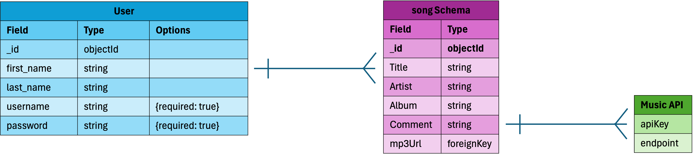

# Three Spins
<em>A MEN Stack CRUD App Project</em>

## 1. Project Idea
Three Spins is an app that allows users to share their three favorite songs. First a user creates a profile (login and password). Once logged in they can use a form to input up to three songs- title, artist, album, and an optional comment. Ideally, an integrated API will fetch a song and add an mp3 url to the song object. When a user visits their profile page, they can see their Three Spins catalog. From there, they can go to a show page where they can see song details, (ideally) play the song, and even edit/delete the song. Non-logged in users can't add songs, but they can see previews of other profiles. No one can visit another's profile...yet(future enhancement).

## 2. [Three Spins - Wire Frame](https://xd.adobe.com/view/0d13061a-a0c7-4e39-9085-322172204751-5840/?fullscreen)

## 3. User Story

  
Click to expand

  
#### a. Sign Up and Create a Profile 

  
view

As a music lover, I want to sign up and create a profile, so I can keep track of my favorite songs and share them with others. 
What I Expect: 
A simple sign-up form where I can enter my username, email, and password. 
A confirmation that my profile has been created successfully. 
The ability to log in immediately after signing up. 

#### b. Add My Favorite Songs 

  
view

As a user, I want to add my favorite songs to my profile, so I can easily access and listen to them whenever I want. 
What I Expect: 
A form where I can enter the song title, artist, and album. 
The app should automatically fetch the MP3 file or a playable link for the song. 
A limit of three favorite songs to keep my profile concise. 

 #### c. Edit or Delete My Favorite Songs 

  
view

As a user, I want to be able to edit or delete my favorite songs, so I can update my profile as my music preferences change. 
What I Expect: 
An "Edit" button next to each song that lets me update the song details. 
A "Delete" button to remove a song from my profile. 
A confirmation message before deleting a song to avoid mistakes. 

 #### d. Listen to My Favorite Songs 

  
view

As a user, I want to see the MP3 file or a playable link for each song, so I can listen to them directly from my profile. 
What I Expect: 
A play button or link next to each song that opens the MP3 file or streams the song. 
The ability to play the song without leaving the app (if possible). 

 #### e. Log In and Log Out 

  
view

As a user, I want to log in and log out of my account, so my favorite songs are secure and only accessible to me. 
What I Expect: 
A log-in form where I can enter my username/email and password. 
A "Log Out" button that securely ends my session. 
A message confirming that I’ve successfully logged out. 

 #### f. View My Profile 

  
view

As a user, I want to view my profile, so I can see my personal information and favorite songs in one place. 
What I Expect: 
A profile page that displays my username, email, and list of favorite songs. 
Clear labels for each song (title, artist, album). 
A way to add more songs if I have fewer than three. 

 #### g. Navigate the App Easily 

  
view

As a user, I want to navigate the app easily, so I can quickly find what I’m looking for. 
What I Expect: 
A navigation menu or links to access the home page, profile, and log-in/log-out options. 
Clear buttons for adding, editing, or deleting songs. 

 #### h. Keep My Data Secure 

  
view

As a user, I want my data to be secure, so I can trust the app with my personal information and favorite songs. 
What I Expect: 
My password should be encrypted and not visible to anyone. 
Only I should be able to edit or delete my favorite songs. 
A secure log-in process that protects my account. 

## 4. Restful Routes

 ### Auth Routes
   <table>
    <thead>
      <tr>
        <th>HTTP Method</th>
        <th>Route</th>
        <th>Description</th>
        <th>Controller Action</th>
      </tr>
    </thead>
    <tbody>
      <tr>
        <td>GET</td>
        <td>/signup</td>
        <td>Display the sign-up form</td>
        <td>new</td>
      </tr>
      <tr>
        <td>POST</td>
        <td>/signup</td>
        <td>Create a new user</td>
        <td>create</td>
      </tr>
      <tr>
        <td>GET</td>
        <td>/login</td>
        <td>Display the log-in form</td>
        <td>login</td>
      </tr>
      <tr>
        <td>POST</td>
        <td>/login</td>
        <td>Log in a user</td>
        <td>authenticate</td>
      </tr>
      <tr>
        <td>GET</td>
        <td>/logout</td>
        <td>Log out a user</td>
        <td>logout</td>
      </tr>
    </tbody>
  </table>

  ### App Routes
  <table>
  <thead>
    <tr>
      <th>HTTP Method</th>
      <th>Route</th>
      <th>Description</th>
      <th>Controller Action</th>
    </tr>
  </thead>
  <tbody>
    <tr>
      <td>GET</td>
      <td>/</td>
      <td>Home page</td>
      <td>index</td>
    </tr>
    <tr>
      <td>GET</td>
      <td>/user/:userId/my_profile</td>
      <td>Display user page with top 3 songs</td>
      <td>index</td>
    </tr>
    <tr>
      <td>GET</td>
      <td>/other_profiles</td>
      <td>Display preview page all user profiles</td>
      <td>index</td>
    </tr>
    <tr>
      <td>GET</td>
      <td>/user/:userId/songs/new</td>
      <td>Display the form to add a new song</td>
      <td>new</td>
    </tr>
    <tr>
      <td>DELETE</td>
      <td>/user/:userId/songs/:songId</td>
      <td>Delete a specific song</td>
      <td>delete</td>
    </tr>
    <tr>
      <td>PUT</td>
      <td>/user/:userId/songs/:songId</td>
      <td>Update a specific song</td>
      <td>update</td>
    </tr>
    <tr>
      <td>POST</td>
      <td>/user/:userId/songs</td>
      <td>Create a new song</td>
      <td>create</td>
    </tr>
    <tr>
      <td>GET</td>
      <td>/user/:userId/songs/:songId/edit</td>
      <td>Display the form to edit a song</td>
      <td>edit</td>
    </tr>
    <tr>
      <td>GET</td>
      <td>/songs/:songId</td>
      <td>Display details of a specific song</td>
      <td>show</td>
    </tr>
  </tbody>
</table>
 
## 5. ERD

  

## 6. Create a Github Repo

<em>If you're reading this, you're in the repo :)</em>